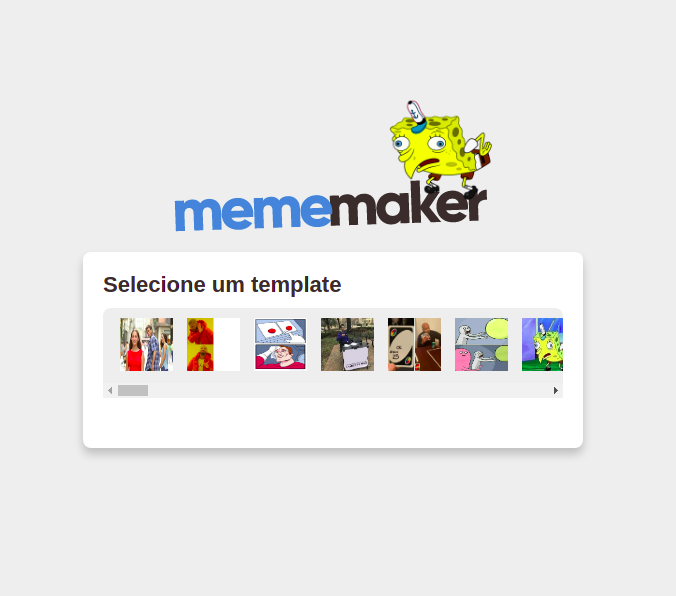

## MemeMaker

Esse projeto é baseado em um tutorial do Mateus Silva utilizando React para o desenvolvimento de uma aplicação de criação de Memes. 
Diferentemente do tutorial original, decidi por utilizar o TypeScript para melhorar os conhecimentos com essa ferramenta.

Como adicional ao tutorial, adicionei um botão para download da imagem utilizando uma string única com o uuid e também uma pré-visualização do meme em "*real time*".

    

Nesse projeto foi utilizado:
- [React](https://reactjs.org/)
- [Styled Components](https://styled-components.com/)
- [Axios](https://github.com/axios/axios)
- [UUID](https://github.com/uuidjs/uuid)
- [TypeScript](https://www.typescriptlang.org/)

## Clone e Iniciar Projeto

Para clonar o repositório basta rodar:

### `git clone https://github.com/brunomatheusc/mememaker.git`

E para inciar o projeto é só rodar:

### `yarn start`

Abra [http://localhost:3000](http://localhost:3000) para visualizar no seu navegador.

